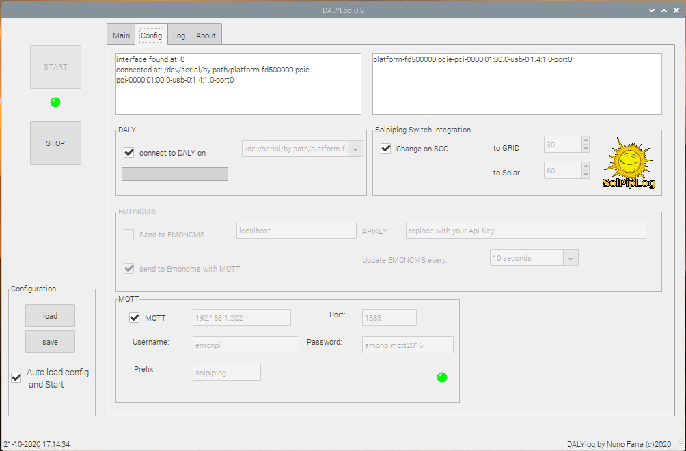

# dalylog
Daly bms logger
Sends data per MQTT to your local broker ( for Home Automation for example ) and to your local Emoncms account.
Interfaces with solpiplog to change the inverter to switch to grid or solar, based on predifined SOC values.

## Appearance

